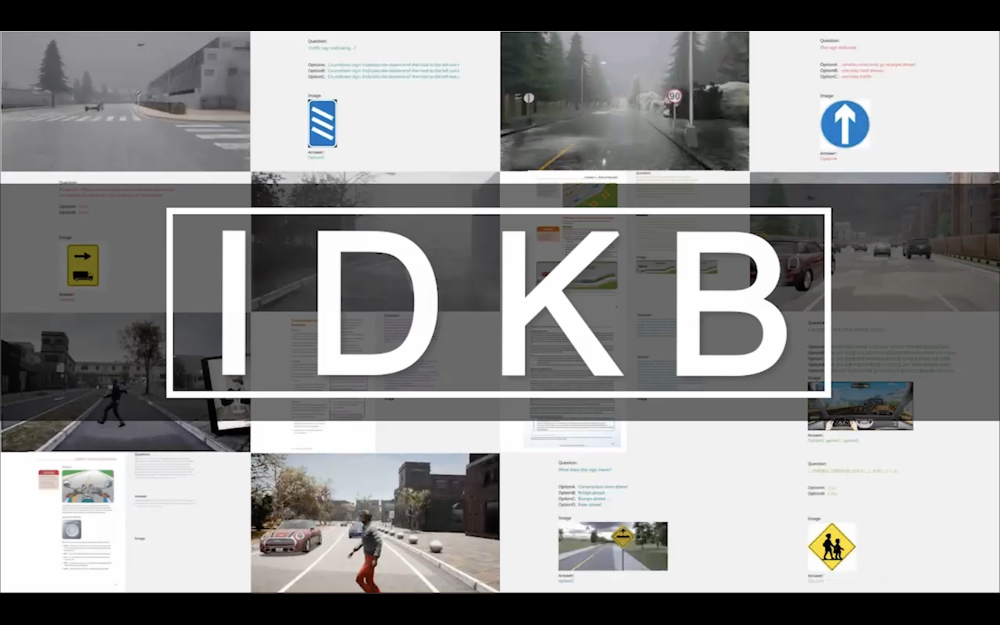
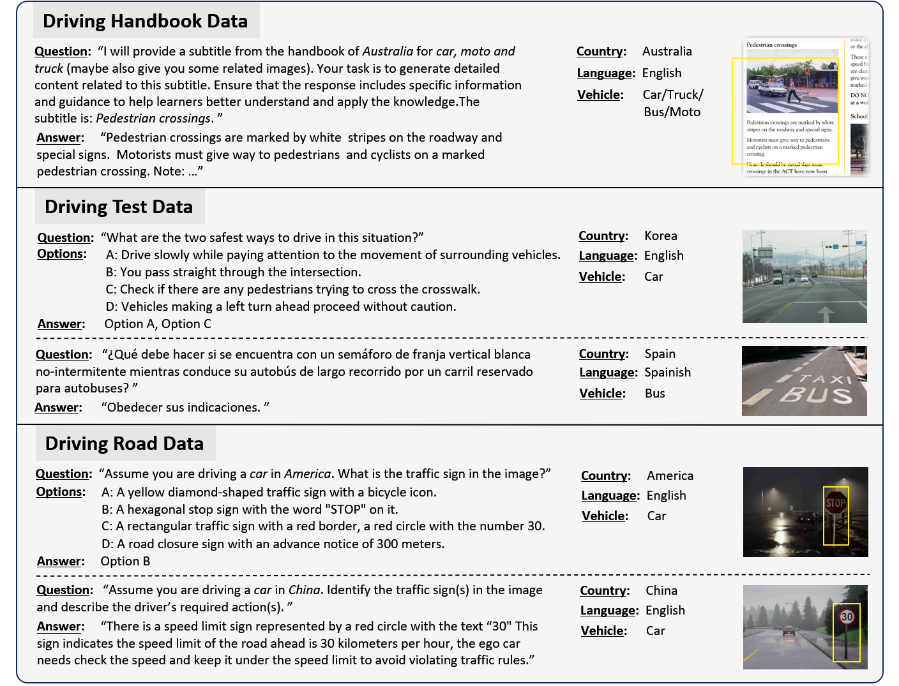

<h1 align="center">    Can LVLMs Obtain a Driver’s License?    <br>    <b>A Benchmark Towards Reliable AGI for Autonomous Driving</b>   </h1>   <h2 align="center">    <a href="https://4dvlab.github.io/project_page/idkb.html">🌐 Project Page</a> &nbsp;|&nbsp;    <a href="https://arxiv.org/abs/2409.02914" style="color:#dc3545;">📄 Arxiv</a>   </h2>   <div align="center">   </div>


## 📑 Table of Contents

1. [Overview](#overview)
2. [Data Overview](#data-overview)
3. [News](#news)
4. [Dataset Download](#dataset-download)
5. [Usage Guide](#usage-guide)
6. [Citation](#citation)


## 🚀 Overview <a name="overview"></a>

Large Vision-Language Models (LVLMs) have gained significant attention for their general knowledge and interpretability in autonomous driving. However, they lack the specialized expertise required for professional and safe driving, such as traffic rules and driving skills—critical elements of driving safety.

To address this, we introduce **IDKB**, a comprehensive dataset with over **1 million driving-related data items** from various countries, including:

- **Driving handbooks**
- **Theory test questions**
- **Simulated road test data**

Similar to the process of obtaining a driver's license, **IDKB** encompasses knowledge from theory to practice, making it the most extensive benchmark for evaluating and enhancing LVLMs in autonomous driving.

Our benchmark includes **15 popular LVLMs** evaluated for their reliability in autonomous driving scenarios, alongside fine-tuning experiments that significantly improved model performance.


## 🗂️ Data Overview <a name="data-overview"></a>

<p float="center">
  
</p>


## 🚩 News <a name="news"></a>

+ **[2024-02-24]** We have refined the dataset format and provided the Google Drive link.
+ **[2024-12-13]** We have provided a download link via Baidu Netdisk.
+ **[2024-12-10]** Our work, IDKB, has been accepted by AAAI 2025.
+ **[2024-09-04]** The ArXiv version of our paper has been released.


# 📚 Dataset Download <a name="dataset-download"></a>

| Platform      | Link                                                         | Access Code |
| ------------- | ------------------------------------------------------------ | ----------- |
| Baidu Netdisk | [Download Here](https://pan.baidu.com/s/1YukK_F6OAaz3lH_m27w9bg) | idkb        |
| Google Drive  | [Download Here](https://drive.google.com/file/d/12XRP8-BeqA6asNRwEsH-OV7ndSZ2Bwsy/view?usp=sharing) | -           |


## 🛠️ Usage Guide <a name="usage-guide"></a>

**TODO:** The usage instructions for IDKB will be provided here, stay tuned!


## 📖 Citation <a name="citation"></a>

If you use our dataset or benchmark in your research, please cite us as:

```
@inproceedings{lu2025can,
  title={Can lvlms obtain a driver’s license? a benchmark towards reliable agi for autonomous driving},
  author={Lu, Yuhang and Yao, Yichen and Tu, Jiadong and Shao, Jiangnan and Ma, Yuexin and Zhu, Xinge},
  booktitle={Proceedings of the AAAI Conference on Artificial Intelligence},
  volume={39},
  number={6},
  pages={5838--5846},
  year={2025}
}
```

