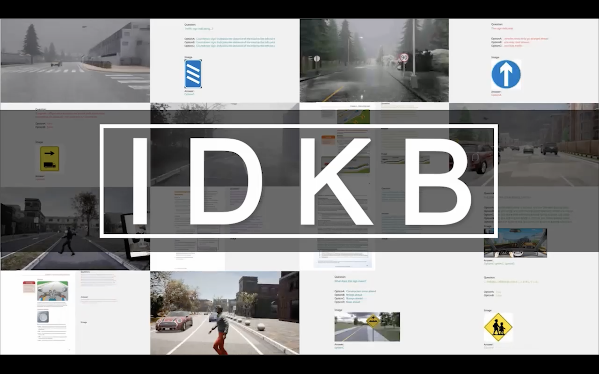

# Can LVLMs Obtain a Driver’s License? A Benchmark Towards Reliable AGI for Autonomous Driving

<div style="text-align: center; line-height: 1.4; font-size: 20px; font-weight: bold;">
  <div class="publication-authors">
    <a href="http://yuhanglu2000.github.io" style="color:#007bff; text-decoration:none;">Yuhang Lu</a><sup>1,*</sup>,
    Yichen Yao<sup>1,*</sup>,
    Jiadong Tu<sup>1,*</sup>,
    Jiangnan Shao<sup>1,*</sup>,
    <a href="http://yuexinma.me" style="color:#007bff; text-decoration:none;">Yuexin Ma</a><sup>1,†</sup>,
    <a href="https://xingezhu.me/aboutme.html" style="color:#007bff; text-decoration:none;">Xinge Zhu</a><sup>2,†</sup>
  </div>

  <div class="publication-affiliations" style="text-align: center; margin-top: 10px; font-size: 16px;">
    <sup>1</sup>ShanghaiTech University, 
    <sup>2</sup>The Chinese University of Hong Kong
  </div>

  <div class="publication-notes" style="text-align: center; margin-top: 10px; font-size: 16px;">
    <sup>*</sup>These authors contributed equally. 
    <sup>†</sup>Corresponding author.
  </div>

<p float="center">
  
</p>

<div style="text-align: left;">
  <a href="https://4dvlab.github.io/project_page/idkb.html" style="font-size:20px; font-weight:bold; text-decoration:none; color:#007bff;">Project Page</a>
  &nbsp;|&nbsp;
  <a href="https://arxiv.org/abs/2409.02914" style="font-size:20px; font-weight:bold; text-decoration:none; color:#dc3545;">Arxiv</a>
</div>


Large Vision-Language Models (LVLMs) have recently garnered significant attention, with many efforts aimed at harnessing their general knowledge to enhance the interpretability and robustness of autonomous driving models. However, LVLMs typically rely on large, general-purpose datasets and lack the specialized expertise required for professional and safe driving. Existing vision-language driving datasets focus primarily on scene understanding and decision-making, without providing explicit guidance on traffic rules and driving skills, which are critical aspects directly related to driving safety. 

To bridge this gap, we propose. <b> IDKB, a large-scale dataset containing over one million data items collected from various countries, including driving handbooks, theory test data, and simulated road test data</b>. Much like the process of obtaining a driver's license, IDKB encompasses nearly all the explicit knowledge needed for driving from theory to practice. In particular, we conducted comprehensive tests on 15 LVLMs using IDKB to assess their reliability in the context of autonomous driving and provided extensive analysis. We also fine-tuned popular models, achieving notable performance improvements, which further validate the significance of our dataset.


## 🗂️ Data Overview

<p float="center">
  
</p>

Intelligent Driving Knowledge Base (IDKB) is structured as a driving knowledge resource, mirroring the process individuals follow to acquire expertise when obtaining a driver's license. 

This process typically involves studying driving handbooks, taking theory tests, and practicing on the road, corresponding to the <b>driving handbook data, driving test data and driving road data</b> of our dataset.


## 🛠️ Data Collection

<p float="center">
  
</p>

<b>Data construction pipeline of IDKB dataset.</b> For Driving Handbook and Driving Test Data, we collect comprehensive driving knowledge resources from internet, followed by data extraction and postprocessing to obtain the final data. For Driving Road Data, we utilize CARLA to generate simulated road scenarios focused on traffic sign comprehension.


## 📊 Data Statistics

<p float="center">
  
</p>

<p>
            The <strong>IDKB dataset</strong> contains <strong>1,016,956</strong> entries, comprising 84.0% Driving Test Data, 11.1% CARLA data, and 5.0% Driving Handbook Data. It spans <strong>multiple countries and languages</strong>, with contributions from regions like China, Italy, and Germany.
        </p>
        <p>
          The data can be divided into  <strong>four groups</strong> according to vehicle type
            <ul>
                <li>Car (61.6% - sedan, jeep, etc.)</li>
                <li>Truck (19.3% - minivan, commercial, LGV, etc.)</li>
                <li>Bus (7.9% - minibus, coaches, etc.)</li>
                <li>Moto (11.2% - motorbike, motorcycle)</li>
            </ul>
        </p>
        <p>
            We utilized proprietary LVLMs to classify data into <strong>four semantic categories</strong>:
            <ul>
                <li>Laws & Regulations (22.2%)</li>
                <li>Road Signs & Signals (38.6%)</li>
                <li>Driving Techniques (22.0%)</li>
                <li>Defensive Driving (17.1%)</li>
            </ul>
        </p>

## 🚩 News

+ We have released the Arxiv version of the paper.


# 📚 Dataset Download:

**The dataset will be available once the paper is accepted. Stay tuned!**


## Citiation

 ```
@misc{lu2024lvlmsobtaindriverslicense,
      title={Can LVLMs Obtain a Driver's License? A Benchmark Towards Reliable AGI for Autonomous Driving}, 
      author={Yuhang Lu and Yichen Yao and Jiadong Tu and Jiangnan Shao and Yuexin Ma and Xinge Zhu},
      year={2024},
      eprint={2409.02914},
      archivePrefix={arXiv},
      primaryClass={cs.CV},
      url={https://arxiv.org/abs/2409.02914}, 
}
 ```


